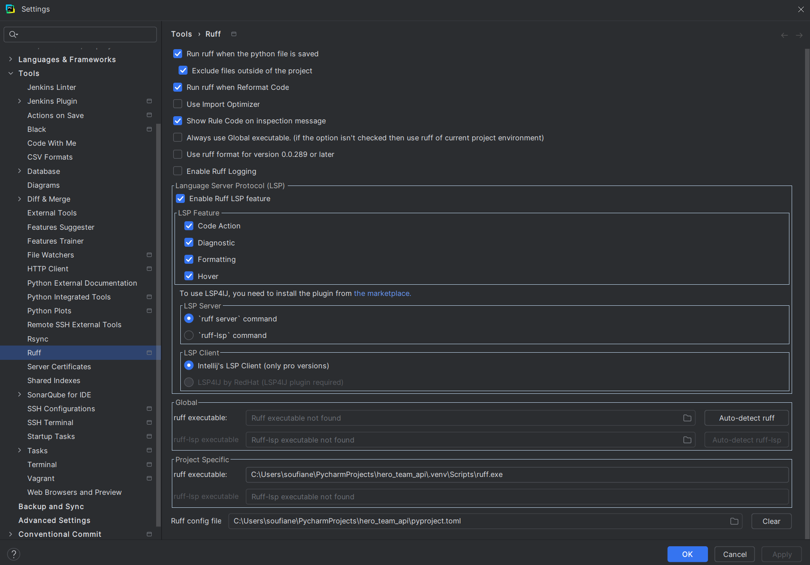

# Ruff Plugin

## Why do we use it ?

`Ruff` is used to quickly find and fix common errors and style issues in Python code, ensuring consistency and quality.

## Pre-requisities

* Installing `Ruff` plugin from the PyCHarm Marketplace is the easiest and most effective way to integrate it into
the PyCharm workflow.
First you need to install the plugin from the Pycharm `File -> Settings -> Plugins`

* You will also need to install the `Ruff` library into your project's virtual environment.

!!! Note
    For further details, see plugin web page [Ruff linter](https://docs.astral.sh/ruff/)

## Plugin configuration

!!! Note
    Under construction !